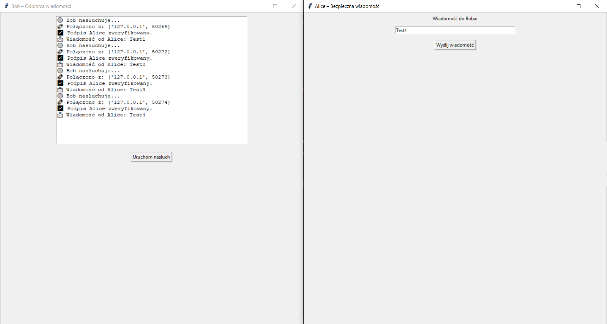

# 🔐 Secure Key Exchange with Mutual Authentication

- ECDH (Elliptic Curve Diffie-Hellman) – do uzgodnienia wspólnego klucza
- ECDSA – do podpisywania wiadomości
- AES-GCM – do szyfrowania danych
- Nonce + timestamp – do zabezpieczenia przed atakami powtórzeniowymi

## 📁 Struktura projektu

📦 Secure_Key_Exchange_with_Mutual_Authentication
┣ 📜 alice_backend.py 
┣ 📜 bob_backend.py 
┣ 📜 common_crypto.py 
┣ 📜 gui_alice.py 
┣ 📜 gui_bob.py 
┗ 📜 README.md

## 🚀 Uruchomienie

1. Zainstaluj zależności:
pip install cryptography

2. Uruchom `gui_bob.py` – Bob zacznie nasłuchiwać.

3. Uruchom `gui_alice.py`, wpisz wiadomość i kliknij "Wyślij".

## 🔧 Technologie

- Python 3.10+
- `cryptography` (ECDH, ECDSA, AESGCM)
- `tkinter` (GUI)

## ✅ Funkcjonalności

- 🔐 Wspólny klucz za pomocą ECDH
- ✅ Obustronne uwierzytelnianie (ECDSA)
- 🔒 Szyfrowanie AEAD (AES-GCM)
- ⏱️ Timestamp jako zabezpieczenie przed replay attack

## 📷 Zrzuty ekranu

## 📌 Autor
- Konrad Gajdziński